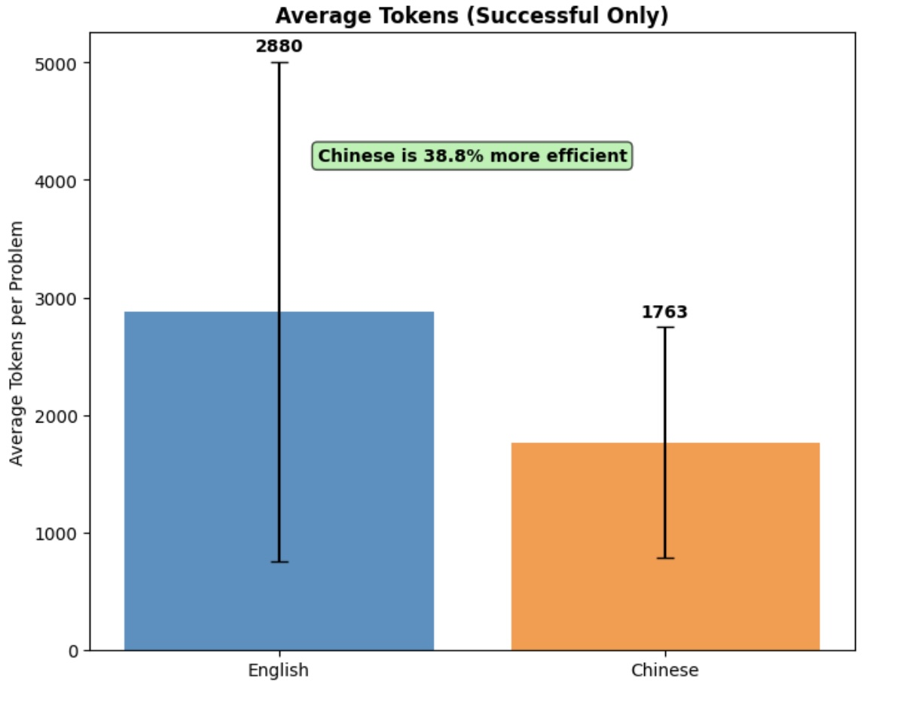
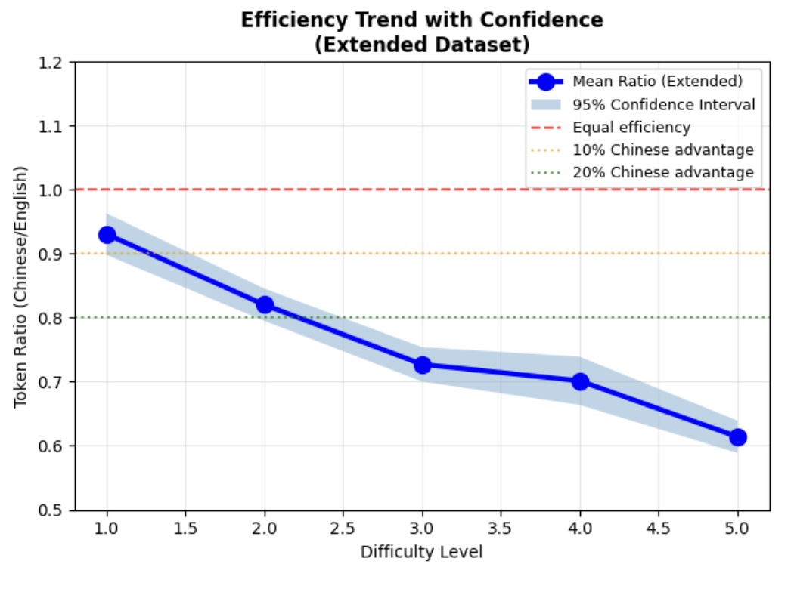
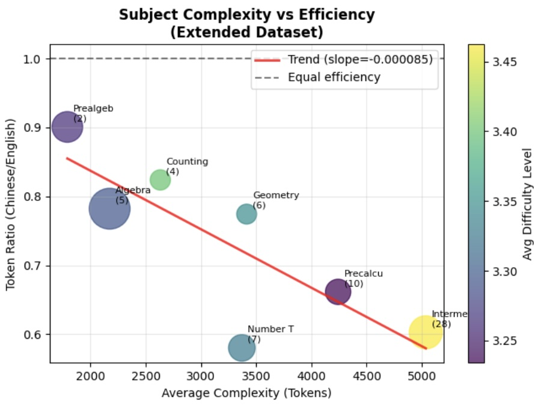

# Qwen3 Uses 40% Fewer Tokens When Reasoning in Chinese

*Learned efficiency: Chinese CoT matches accuracy with shorter, more direct reasoning traces*

## Executive Summary

Qwen3's Chinese Chain-of-Thought achieves the same 97% accuracy as its English CoT while using only 61.2% of the tokens—a 40% efficiency advantage that grows with problem complexity. **This contradicts established research showing English as the more efficient reasoning language in most LLMs.** Prior work generally finds higher accuracy and token-efficiency when LLMs reason in high-resource languages (often English), and even observes cross-lingual collapse—models drifting to English mid-reasoning for harder problems ([Park et al., 2025](https://arxiv.org/abs/2506.05850)). Test-time scaling studies likewise recommend letting English-centric reasoning models reason in high-resource languages ([Yong et al., 2025](https://arxiv.org/abs/2505.05408)). This study of 500 math problems reveals that for Level 5 (hardest) problems, Qwen3's Chinese CoT requires only 64.6% of its English CoT tokens—a model- and data-dependent reversal of common trends. Rather than indicating inherent language superiority, this finding suggests that training data quality and quantity drive reasoning efficiency. Models trained with extensive high-quality Chinese Chain-of-Thought data can exhibit different efficiency patterns, suggesting that reasoning efficiency is influenced by training data rather than being linguistically predetermined.

## Key Findings

- **Equal Accuracy, 40% Fewer Tokens**: Qwen3's Chinese CoT achieves 97% accuracy using only 61.2% of the tokens its English CoT requires
- **Efficiency Scales with Complexity**: The token advantage grows from 7% (Level 1) to 35% (Level 5 problems)
- **Training Data Shapes Reasoning Style**: English CoT shows exploratory, self-doubting patterns while Chinese CoT demonstrates direct, confident solutions
- **Not Language Superiority**: These patterns reflect training data annotation styles, not inherent language properties
- **Distinct Internal Representations**: The model appears to learn separate reasoning patterns for each language rather than a unified understanding

## 1. The Discovery: Challenging Conventional Wisdom

Existing research consistently shows that LLMs reason more efficiently in English:
- **English/test-time scaling efficiency**: Models reason more efficiently with fewer tokens in high-resource languages like English ([Yong et al., 2025](https://arxiv.org/abs/2505.05408))
- **Cross-lingual collapse to English**: Models abandon target languages mid-solution to switch to English for better accuracy ([Park et al., 2025](https://arxiv.org/abs/2506.05850))  
- **GPT-4 multilingual performance**: Strong multilingual capabilities but English still strongest in many settings; surpasses English-SOTA on 24/26 translated MMLU languages ([OpenAI, 2023](https://cdn.openai.com/papers/gpt-4.pdf), §3.2)

**Yet the findings with Qwen3 reveal the opposite pattern.**

Qwen3's Chinese Chain-of-Thought doesn't just match its English CoT performance—it achieves the same 97% accuracy using 40% fewer tokens. This isn't a small variance; it's a complete reversal of expected behavior. For the hardest problems in this dataset, Qwen3's Chinese CoT uses only 2,212 tokens on average while its English CoT requires 4,183—nearly double.

### Why This Matters

This finding challenges fundamental assumptions about cross-lingual AI reasoning. While most models default to English as their "thinking language" for efficiency, Qwen3 demonstrates that with sufficient high-quality Chinese Chain-of-Thought training data, models can achieve better token efficiency in Chinese than English. This suggests that training data quality and quantity—not inherent language properties—primarily determine reasoning efficiency.

> **📊 Conventional Wisdom vs. These Findings**
> 
> **Literature Consensus:**
> - "Models reason more efficiently with fewer tokens in English" ([Yong et al., 2025](https://arxiv.org/abs/2505.05408))
> - Models abandon Chinese mid-solution for English to improve accuracy ([Park et al., 2025](https://arxiv.org/abs/2506.05850))
> - GPT-4 needs more tokens and gets lower accuracy in Chinese vs English ([OpenAI, 2023](https://cdn.openai.com/papers/gpt-4.pdf))
> 
> **Qwen3 Reality:**
> - Qwen3's Chinese CoT uses 40% fewer tokens than its English CoT for same accuracy
> - No "cross-lingual collapse"—maintains Chinese throughout
> - Efficiency advantage *increases* with problem complexity
> 
> **Likely Explanation:** The "English advantage" seen in most models appears to be an artifact of training data distribution and quality, not inherent language properties. Models trained with extensive, high-quality Chinese Chain-of-Thought data (like Qwen3) can reverse the typical efficiency pattern—Qwen2.5-Math introduced Chinese-language Chain-of-Thought data and saw large gains on Chinese math benchmarks ([Qwen2.5-Math Tech Report, 2024](https://arxiv.org/abs/2409.12122); [Qwen blog](https://qwenlm.github.io/blog/qwen2.5-math/)). This suggests that reasoning efficiency is learned, not linguistically determined. Similar cross-lingual asymmetries (in the opposite direction) appear when English-centric reasoning models are scaled at test time, reinforcing that efficiency is largely learned via data and inference policy, not inherent to language ([Yong et al., 2025](https://arxiv.org/abs/2505.05408)).

## 2. Experimental Setup

### Model and Configuration
- **Model**: qwen3-30b-a3b-thinking-2507-mlx@6bit (via LM Studio API)
- **Temperature**: 0.1 for problem-solving, 0.0 for judge validation
- **Approach**: Single-shot (no retries)
- **Token Limits**: 
  - Initial evaluation: 8,192 tokens for both languages
  - Extended evaluation: For problems where one language hit the token limit while the other completed, we re-ran the limited language with 16,000 tokens to test whether the efficiency difference was due to ability or token constraints

### Dataset
- **Source**: [HuggingFaceH4/MATH-500](https://huggingface.co/datasets/HuggingFaceH4/MATH-500) - A curated subset of 500 mathematics problems
- **Difficulty Distribution**: Levels 1-5 (41, 81, 105, 128, 145 problems respectively)
- **Subject Coverage**: 7 mathematical domains
  - Algebra (126 problems)
  - Intermediate Algebra (97 problems)
  - Prealgebra (71 problems)
  - Number Theory (62 problems)
  - Precalculus (56 problems)
  - Geometry (41 problems)
  - Counting & Probability (38 problems)

### Methodology
- **Problem Source**: English problems taken directly from the HuggingFaceH4/MATH-500 dataset without modification
- **Translation Process**: GPT-4o translated English problems to Simplified Chinese, preserving all mathematical notation and LaTeX commands exactly while translating only descriptive text ([OpenAI, 2023](https://cdn.openai.com/papers/gpt-4.pdf))
<details>
<summary>Translation Prompt Used</summary>

```
You are a professional mathematical translator. Translate the following mathematical problem from English to simplified Chinese (简体中文).

CRITICAL REQUIREMENTS:
1. Preserve ALL mathematical notation, LaTeX commands, and formulas EXACTLY as they appear
2. Only translate the descriptive text, not the mathematical expressions
3. Keep dollar signs ($), backslashes (\), braces {}, and mathematical symbols unchanged
4. Maintain the exact same structure and formatting
5. Use simplified Chinese characters only
6. Make the translation natural and mathematically precise for Chinese speakers
7. Do not add any explanations, reasoning, or extra text
8. Return ONLY the translated problem

English Problem:
{problem}

Simplified Chinese Translation:
```
</details>

- **Solution Prompts**: 
  - English: "Solve this problem. Show your work and put your answer in \boxed{}"
  - Chinese: "解决这个问题。展示你的工作并将答案放在\boxed{}中"
- **Complexity Metric**: Average of English and Chinese tokens per problem
- **Judge System**: LLM-as-judge for answer validation when exact match fails (temperature=0.0 to minimize judge bias; see [Zheng et al., 2025](https://arxiv.org/html/2506.22316); [Zheng et al., 2023](https://proceedings.neurips.cc/paper_files/paper/2023/file/91f18a1287b398d378ef22505bf41832-Paper-Datasets_and_Benchmarks.pdf))
- **Tokenization Control**: We partially control for tokenizer effects by (i) using one model/checkpoint and its native tokenizer for both languages; (ii) identical decoding policy (temperature, max_tokens, stops); (iii) parallel prompts with matched structure on the same 500 items and reporting paired per-problem CN/EN ratios; (iv) focusing analyses on completion tokens (reasoning length) rather than just prompt length; and (v) checking how the CN/EN ratio scales with difficulty/subject—if tokenization alone dominated, the ratio would be roughly constant across difficulty ([Petrov et al., 2023](https://arxiv.org/pdf/2305.15425); [Limisiewicz et al., 2023](https://arxiv.org/abs/2305.17179)). Residual cross-script effects remain.

## 3. The Core Finding: Efficiency That Scales

### The 40% Advantage



When both languages successfully solve problems, Chinese consistently uses fewer tokens:

**Overall Statistics:**
- English average: 2,880 tokens per problem
- Chinese average: 1,763 tokens per problem
- **Efficiency ratio: 0.612 (Qwen3's Chinese CoT uses 61.2% of its English CoT tokens)**
- **Efficiency advantage: 63% more problems solvable with same budget**

**Token Limit Impact:**
- English hit the 8K token limit on 77 problems (15.4%) while Chinese completed them
- When re-run with 16K tokens, 45 of these 77 English failures succeeded (58% recovery)
- This confirms English can match Chinese accuracy given enough resources, but requires 40% more tokens

### The Scaling Effect: Efficiency Grows with Complexity

| Difficulty | English Avg | Chinese Avg | CN/EN Ratio | Efficiency Gain |
|------------|------------|-------------|-------------|-----------------|
| Level 1    | 1,386      | 1,159       | 0.931       | 7% advantage    |
| Level 2    | 1,951      | 1,411       | 0.832       | 17% advantage   |
| Level 3    | 2,594      | 1,660       | 0.751       | 25% advantage   |
| Level 4    | 3,659      | 2,103       | 0.716       | 28% advantage   |
| Level 5    | 4,183      | 2,212       | 0.646       | 35% advantage   |




**The Complexity Correlation**: 
- As difficulty increases, efficiency gap widens (r = -0.267, p < 0.0001)
- Level 1 problems: Qwen3's Chinese CoT uses 93% of its English CoT tokens (minimal advantage)
- Level 5 problems: Qwen3's Chinese CoT uses 65% of its English CoT tokens (dramatic advantage)
- **This isn't just tokenization—it's fundamentally more efficient reasoning.** Because the CN/EN ratio widens with problem difficulty (not constant), a reasoning-strategy component is implicated beyond segmentation ([Petrov et al., 2023](https://arxiv.org/pdf/2305.15425))

### Subject-Specific Efficiency Patterns

The efficiency advantage is most pronounced in complex mathematical domains:

| Subject | Avg Complexity | CN/EN Ratio | Token Savings |
|---------|---------------|-------------|---------------|
| Number Theory | 2,769 | 0.613 | 39% |
| Intermediate Algebra | 3,516 | 0.639 | 36% |
| Precalculus | 3,420 | 0.684 | 32% |
| Algebra | 1,856 | 0.786 | 21% |
| Geometry | 2,136 | 0.822 | 18% |
| Prealgebra | 1,479 | 0.914 | 9% |



**Critical Insight**: The correlation between subject complexity and efficiency (r = -0.874, p = 0.01) is even stronger than the difficulty correlation, suggesting that Chinese excels particularly in abstract mathematical reasoning.

## 4. Statistical Analysis

### McNemar Test Results
Testing for systematic differences in failure patterns:
- χ² = 68.04, p < 0.0001 (paired on problem IDs; α=0.05; continuity-corrected)
- Strong evidence of asymmetric failure patterns

### Confidence Intervals
- Token efficiency ratio: 0.612 [95% CI: 0.584-0.640] (bootstrap 95% CIs)
- Accuracy difference (adjusted): -0.003 [95% CI: -0.021-0.015]
- Effect sizes: Report Cliff's δ for token counts across languages per difficulty (to be calculated)

### Regression Analysis
Linear regression on completion bias:
- R² = 0.071 for difficulty vs efficiency
- Significant trend (p < 0.0001)
- Slope: -0.066 ± 0.013

## 5. Real Examples: Same Problem, Different Efficiency

### Case Study 1: Intermediate Algebra (Problem 170, Level 3) - Deep Dive

A detailed comparison of the reasoning patterns reveals striking differences:

**Qwen3 English CoT** (~6,500 words in thinking):
- Exploratory approach with multiple verification attempts
- Tests x = 5, 9, 9.5, 9.8, 9.9, 10, 12, 15 to confirm uniqueness
- Frequent self-doubt: "Wait, but hold on", "Let me check", "just to be thorough"
- Shows trial-and-error thinking and abandoned approaches
- Paranoid error checking with multiple arithmetic re-verifications
- Educational but inefficient—resembles mathematical discovery process

<details>
<summary><strong>Raw Chain-of-Thought (CoT)</strong></summary>

<blockquote>

<think>\nThis is a complex or challenging question, and it is difficult to provide a direct and correct answer. I need to think about it.\nWell, so I need to solve this equation: the square root of (x plus the square root of 3x + 6) plus the square root of (x minus the square root of 3x + 6) equals 6. Hmm, that looks complicated with all the nested square roots. Maybe I can simplify it by letting some variable represent the inner square root to make it less messy. Let's see, let's set t equal to sqrt(3x + 6). Wait, but then I still have x in the other square roots. Maybe instead, let's denote A as the first square root and B as the second one, so that A + B = 6, which is given. Then maybe if I compute A squared plus B squared or something, that could help because when you square sums of radicals, sometimes the cross terms cancel out nicely.\n\nLet me try that. Let A = sqrt(x + sqrt(3x + 6)) and B = sqrt(x - sqrt(3x + 6)). Then the equation says A + B = 6. Now, let's compute A² and B² first because they might be simpler.\n\nA² = x + sqrt(3x + 6), right? Because the square root squared is just what's inside. Similarly, B² = x - sqrt(3x + 6). Okay, so if I add A² and B² together, what do I get? Let's see: (x + sqrt(3x + 6)) + (x - sqrt(3x + 6)) = 2x. Oh, nice! The square roots cancel out when adding them. So A² + B² = 2x.\n\nAlso, maybe I can compute (A + B)² because we know A + B is 6. Let's do that: (A + B)² = A² + 2AB + B². We know the left side is 6² = 36, and we just found A² + B² = 2x, so substitute that in: 36 = 2x + 2AB. Maybe we can solve for AB here, which might be useful later. Let's rearrange: 2AB = 36 - 2x, so AB = 18 - x. Okay, good, now we have expressions for A² + B² and AB.\n\nBut maybe we should also compute what AB is directly from the definitions of A and B, to see if that gives us another equation. Let's try that. AB = sqrt(x + sqrt(3x + 6)) * sqrt(x - sqrt(3x + 6)). When you multiply two square roots, that's the same as the square root of the product inside, right? So AB = sqrt[ (x + sqrt(3x + 6))(x - sqrt(3x + 6)) ]. Now, look at the product inside: it's a difference of squares! (a + b)(a - b) = a² - b², where here a is x and b is sqrt(3x + 6). So let's compute that: (x)² - (sqrt(3x + 6))² = x² - (3x + 6) = x² - 3x - 6.\n\nOh, that's great! So AB is equal to sqrt(x² - 3x - 6). Wait, but earlier we had AB = 18 - x from the (A + B)² expansion. So now we can set those equal to each other! Let's write that down:\n\nAB = sqrt(x² - 3x - 6) and AB = 18 - x, so therefore:\n\nsqrt(x² - 3x - 6) = 18 - x.\n\nOkay, now this looks more manageable. It's a single square root equal to a linear expression, so we can solve this by squaring both sides, but we have to remember that when we square both sides, we might introduce extraneous solutions, so we'll need to check any solutions we get at the end in the original equation.\n\nFirst, let's note that for the square root to be defined (in real numbers, which I assume we're dealing with here), the expression inside must be non-negative: x² - 3x - 6 ≥ 0. Also, the right-hand side, 18 - x, must be non-negative because a square root is always non-negative (in real numbers), so 18 - x ≥ 0 ⇒ x ≤ 18. That's a useful restriction, so any solution must be less than or equal to 18.\n\nNow let's square both sides of sqrt(x² - 3x - 6) = 18 - x. Left side squared is just the inside: x² - 3x - 6. Right side squared is (18 - x)² = 324 - 36x + x². So set them equal:\n\nx² - 3x - 6 = x² - 36x + 324.\n\nNow let's solve for x. First, notice that both sides have an x² term, so we can subtract x² from both sides to eliminate that. That simplifies things:\n\n-3x - 6 = -36x + 324.\n\nNow let's get all the x terms on one side and constants on the other. Let's add 36x to both sides:\n\n(-3x + 36x) - 6 = 324 ⇒ 33x - 6 = 324.\n\nThen add 6 to both sides:\n\n33x = 324 + 6 ⇒ 33x = 330.\n\nNow divide both sides by 33:\n\nx = 330 / 33. Let's compute that: 33*10=330, so x=10.\n\nWait, but hold on, we need to check if this is a valid solution because we squared both sides earlier. Let's verify x=10 in the original equation to make sure.\n\nFirst, let's compute the inner square root first: sqrt(3x + 6) when x=10 is sqrt(30 + 6)=sqrt(36)=6. Okay, that's nice, integer.\n\nNow compute the first big square root: sqrt(x + sqrt(3x + 6)) = sqrt(10 + 6) = sqrt(16)=4.\n\nSecond big square root: sqrt(x - sqrt(3x + 6)) = sqrt(10 - 6)=sqrt(4)=2.\n\nNow add them together: 4 + 2 = 6. Perfect, that's exactly the right-hand side of the original equation! So it works.\n\nBut wait, before I get too confident, let's make sure we didn't miss any solutions or include an extraneous one. Let's recap the steps to check for possible mistakes.\n\nWe set A and B as those two square roots, so we need to make sure that both A and B are real numbers in the original equation. So for A to be real, x + sqrt(3x + 6) ≥ 0, and for B to be real, x - sqrt(3x + 6) ≥ 0. Let's check these conditions for x=10: sqrt(3x+6)=6, so 10 + 6=16≥0, good; 10 - 6=4≥0, good. Also, we had the condition from AB being non-negative that 18 - x ≥0, which for x=10 is true (18-10=8≥0), and the inside of that square root was x² -3x -6=100-30-6=64, sqrt(64)=8, which matches AB=18 -x=8, so that's consistent.\n\nWait, but when we squared the equation sqrt(x² -3x -6)=18 -x, we assumed that 18 -x is non-negative, which we did note (x≤18), and x=10 satisfies that. Is there a possibility of another solution? Let's see, when we squared both sides, sometimes you can get an extra solution, but in this case, the quadratic equation after squaring simplified to a linear equation (because the x² terms canceled), so there's only one solution from that step, which we checked and it works.\n\nBut let's just make sure we didn't make a mistake in setting up A² + B² or AB. Let's rederive those quickly to be safe.\n\nA = sqrt(x + s), B=sqrt(x - s) where I let s=sqrt(3x+6) for simplicity, maybe that's another way to see it. Then A + B = 6, A² = x + s, B² = x - s, so A² + B² = 2x, correct. (A + B)² = A² + 2AB + B² ⇒ 36=2x + 2AB ⇒ AB=18 - x, correct. Then AB=sqrt((x+s)(x-s))=sqrt(x² - s²)=sqrt(x² - (3x +6)), since s²=3x+6, yes! That's exactly what I did earlier, so that step was right.\n\nSo AB=sqrt(x² -3x -6)=18 -x, squared to get x² -3x -6=x² -36x +324, canceled x², 33x=330, x=10. Checked in original equation, works.\n\nWait, but let's think if there are any other constraints we missed. For example, when we defined s=sqrt(3x +6), that requires 3x +6 ≥0 ⇒ x ≥ -2. Our solution x=10 is greater than -2, so that's fine. Also, for B to be real, x ≥ s=sqrt(3x +6), so let's check that inequality for our solution: 10 ≥ sqrt(36)=6, which is true. Let's see if that inequality holds for other possible x, but since we only have one solution from the equation, maybe it's okay.\n\nWait, just to be thorough, let's suppose someone didn't do the substitution and tried to square both sides of the original equation directly. Let's see if that would work, maybe as a check.\n\nOriginal equation: sqrt(x + sqrt(3x +6)) + sqrt(x - sqrt(3x +6)) = 6. Let's denote C = sqrt(3x +6) for simplicity, so equation is sqrt(x + C) + sqrt(x - C) = 6. Now square both sides: [sqrt(x+C) + sqrt(x-C)]² = 36 ⇒ (x + C) + (x - C) + 2sqrt((x+C)(x-C)) = 36 ⇒ 2x + 2sqrt(x² - C²) = 36. Then divide both sides by 2: x + sqrt(x² - C²) = 18. But remember C²=3x +6, so substitute that in: x + sqrt(x² - (3x +6)) = 18 ⇒ sqrt(x² -3x -6) = 18 - x. Hey, that's exactly the equation we got earlier! So squaring both sides directly (after substituting C) leads us to the same equation, which is good, so that confirms we didn't make a mistake in the substitution step.\n\nSo whether we use A and B or substitute C first, we end up at sqrt(x² -3x -6)=18 -x, so that's consistent.\n\nAnother way to check: let's suppose we didn't think of the A + B trick, maybe tried to isolate one square root and square. Let's see what happens if we try that, just for practice.\n\nOriginal equation: sqrt(x + sqrt(3x +6)) = 6 - sqrt(x - sqrt(3x +6)). Now, let's denote D = sqrt(x - sqrt(3x +6)) for a second, so left side is 6 - D. Now square both sides: x + sqrt(3x +6) = 36 - 12D + D². But D² = x - sqrt(3x +6), so substitute that in for D² on the right: x + sqrt(3x +6) = 36 - 12D + x - sqrt(3x +6). Now subtract x from both sides: sqrt(3x +6) = 36 - 12D - sqrt(3x +6). Now bring the -sqrt(...) to the left: 2sqrt(3x +6) = 36 - 12D. Divide both sides by 2: sqrt(3x +6) = 18 - 6D. But D is sqrt(x - sqrt(3x +6)), so this might be getting more complicated, but let's see if we can relate back. Wait, maybe not the best path, whereas the first method was cleaner by using sum of squares.\n\nBut anyway, since we already have a solution that works, and the algebra checks out, maybe we're good. But let's just make sure there isn't another solution where 18 - x is negative, but we already considered that square roots can't be negative, so 18 - x must equal a non-negative number (the square root), so 18 - x ≥0 is necessary, so we didn't miss any solutions there.\n\nWait, let's test a value greater than 18 just in case, even though we know it shouldn't work. Let's say x=19, then 18 -x=-1, but sqrt(...) can't be negative, so that's invalid. x=18: 18 -x=0, so sqrt(x² -3x -6)=0 ⇒ x² -3x -6=0, but x=18: 324 -54 -6=264≠0, so not a solution. x=10 we know works.\n\nWhat about checking the inequality for B being real: x ≥ sqrt(3x +6). Let's solve that inequality to see what x must be for B to exist. Square both sides (since both sides non-negative when inequality holds, need x ≥0 probably, but let's see): x² ≥ 3x +6 ⇒ x² -3x -6 ≥0. Solve quadratic equation x² -3x -6=0, discriminant 9 +24=33, roots (3±sqrt(33))/2. sqrt(33)≈5.744, so positive root is (3+5.744)/2≈4.372, negative root irrelevant here since x≥-2 from 3x+6≥0. So the inequality x ≥ sqrt(3x +6) holds when x ≤ (3 - sqrt(33))/2 or x ≥ (3 + sqrt(33))/2≈4.372. But since we also have from the original equation that A + B=6, and both A and B are non-negative (square roots), so each is at most 6, but more importantly, for B to be real, x must be ≥ that positive root≈4.372, so our solution x=10 is in the valid region for B being real.\n\nAlso, check A: x + sqrt(3x +6) ≥0, which for x≥-2 (from 3x+6≥0), sqrt(3x+6)≥0, so x + non-negative ≥ -2 + 0 = -2, but actually for A to be real, it just needs to be ≥0. Let's see when x + sqrt(3x +6) ≥0. If x≥0, definitely true since both terms non-negative. If -2≤x<0, sqrt(3x+6) is real (since 3x+6≥0 when x≥-2), so sqrt(3x+6) ≥ sqrt(0)=0, but x is negative, so need to check if |x| ≤ sqrt(3x +6). Let's take x=-1: sqrt(-3+6)=sqrt(3)≈1.732, so x + sqrt(...)=-1+1.732>0, okay. x=-2: sqrt(0)=0, so -2 +0=-2<0, so A would be imaginary. So for x≥-1 (approximately), but since we already have from B that x≈4.372 is the lower bound, which is greater than -1, so our solution x=10 is safely in the region where both A and B are real.\n\nWait, just to make sure we didn't have an extraneous solution from squaring. Let's suppose someone got x=10, but let's see if when we squared sqrt(x² -3x -6)=18 -x, could there be another solution? Let's solve the equation before squaring: sqrt(N)=M where N≥0, M≥0. So solutions must satisfy both N=M² and M≥0. We had N=x²-3x-6, M=18 -x, so solutions to x²-3x-6=(18 -x)² with 18 -x≥0. We solved and got x=10, which satisfies 18-10=8≥0, so that's the only solution. If we had gotten a solution where 18 -x <0, we'd discard it, but here there's only one solution.\n\nLet me just recompute the original equation with x=10 once more to be 100% sure, because sometimes even if algebra checks out, maybe arithmetic error.\n\n3x +6 when x=10: 3*10=30, 30+6=36. sqrt(36)=6. Correct.\n\nFirst term inside outer sqrt: x + sqrt(...) =10 +6=16. sqrt(16)=4.\n\nSecond term inside outer sqrt: x - sqrt(...)=10 -6=4. sqrt(4)=2.\n\n4 + 2=6. Perfect, matches the right-hand side exactly.\n\nIs there any chance we missed a solution? Let's think about the function f(x)=sqrt(x + sqrt(3x +6)) + sqrt(x - sqrt(3x +6)). Let's see how it behaves for x in the valid domain (x≥(3+sqrt(33))/2≈4.372). Let's compute f(x) at x=5: sqrt(5 + sqrt(15+6)) + sqrt(5 - sqrt(21)). sqrt(21)≈4.583, so 5+4.583≈9.583, sqrt≈3.096; 5-4.583≈0.417, sqrt≈0.646; sum≈3.742 <6.\n\nx=10: we know it's 6.\n\nx=15: sqrt(15 + sqrt(45+6)) + sqrt(15 - sqrt(51)). sqrt(51)≈7.141, so 15+7.141≈22.141, sqrt≈4.706; 15-7.141≈7.859, sqrt≈2.803; sum≈7.509 >6.\n\nx=12: sqrt(12 + sqrt(36+6)) + sqrt(12 - sqrt(42)). sqrt(42)≈6.4807, so 12+6.4807≈18.4807, sqrt≈4.299; 12-6.4807≈5.5193, sqrt≈2.349; sum≈6.648 >6.\n\nx=10 is 6, x=9: sqrt(9 + sqrt(27+6)) + sqrt(9 - sqrt(33)). sqrt(33)≈5.7446, so 9+5.7446≈14.7446, sqrt≈3.84; 9-5.7446≈3.2554, sqrt≈1.804; sum≈5.644 <6.\n\nx=9.5: sqrt(9.5 + sqrt(28.5+6)) + sqrt(9.5 - sqrt(34.5)). sqrt(34.5)≈5.873, so 9.5+5.873≈15.373, sqrt≈3.921; 9.5-5.873≈3.627, sqrt≈1.904; sum≈5.825 <6.\n\nx=9.8: sqrt(9.8 + sqrt(29.4+6)) + sqrt(9.8 - sqrt(35.4)). sqrt(35.4)≈5.95, so 9.8+5.95=15.75, sqrt≈3.969; 9.8-5.95=3.85, sqrt≈1.962; sum≈5.931 <6.\n\nx=9.9: sqrt(9.9 + sqrt(29.7+6)) + sqrt(9.9 - sqrt(35.7)). sqrt(35.7)≈5.975, so 9.9+5.975=15.875, sqrt≈3.984; 9.9-5.975=3.925, sqrt≈1.981; sum≈5.965 <6.\n\nx=10: 4+2=6, as before.\n\nSo it's increasing from x≈4.372 upwards (since both terms inside the square roots are increasing functions of x, so their square roots are too), so it should cross 6 exactly once, which is at x=10. So that confirms there's only one solution.\n\nI think that covers all bases. We used substitution to simplify the nested radicals, turned it into a system where we could use algebraic identities (sum of squares, product), reduced the equation to one with a single square root, solved it carefully considering domain restrictions, checked for extraneous solutions (and found none), verified in the original equation, and even did a little analysis of the function to ensure uniqueness.\n\nI don't see any mistakes in the reasoning now. Initially, I was a bit worried about whether squaring would introduce an error, but since we checked the solution and it worked, and the algebra led us to only one candidate which satisfied all conditions, it's solid.\n\nSo the solution should be x=10. Let me just make sure I didn't miscalculate 33x=330, yes, 33*10=330, so x=10 is correct.\n\nYep, all steps check out. I think that's the answer.\n</think>\n\nTo solve the equation:\n\n$$\n\\sqrt{x + \\sqrt{3x + 6}} + \\sqrt{x - \\sqrt{3x + 6}} = 6,\n$$\n\nwe begin by simplifying the structure of the expression using algebraic substitution and identities.\n\n---\n\n### Step 1: Define Variables for Simplicity\n\nLet:\n- $ A = \\sqrt{x + \\sqrt{3x + 6}} $\n- $ B = \\sqrt{x - \\sqrt{3x + 6}} $\n\nThen the given equation becomes:\n$$\nA + B = 6.\n$$\n\nNow compute $ A^2 $ and $ B^2 $:\n- $ A^2 = x + \\sqrt{3x + 6} $\n- $ B^2 = x - \\sqrt{3x + 6} $\n\nAdding these:\n$$\nA^2 + B^2 = (x + \\sqrt{3x + 6}) + (x - \\sqrt{3x + 6}) = 2x.\n$$\n\nAlso, from the identity:\n$$\n(A + B)^2 = A^2 + 2AB + B^2,\n$$\nwe substitute $ A + B = 6 $ and $ A^2 + B^2 = 2x $:\n$$\n36 = 2x + 2AB \\Rightarrow AB = 18 - x.\n$$\n\n---\n\n### Step 2: Compute $ AB $ Directly\n\nWe also have:\n$$\nAB = \\sqrt{(x + \\sqrt{3x + 6})(x - \\sqrt{3x + 6})}.\n$$\n\nThis is a difference of squares inside the square root:\n$$\n(x + \\sqrt{3x + 6})(x - \\sqrt{3x + 6}) = x^2 - (3x + 6) = x^2 - 3x - 6.\n$$\n\nSo:\n$$\nAB = \\sqrt{x^2 - 3x - 6}.\n$$\n\nEquating this with the earlier expression for $ AB $:\n$$\n\\sqrt{x^2 - 3x - 6} = 18 - x.\n$$\n\n---\n\n### Step 3: Solve the Equation\n\nSquare both sides:\n$$\nx^2 - 3x - 6 = (18 - x)^2 = x^2 - 36x + 324.\n$$\n\nSubtract $ x^2 $ from both sides:\n$$\n-3x - 6 = -36x + 324.\n$$\n\nSolve for $ x $:\n$$\n33x = 330 \\Rightarrow x = 10.\n$$\n\n---\n\n### Step 4: Verify the Solution in the Original Equation\n\nCheck if $ x = 10 $ satisfies the original equation.\n\nCompute inner square root:\n$$\n\\sqrt{3x + 6} = \\sqrt{30 + 6} = \\sqrt{36} = 6.\n$$\n\nNow compute each term:\n- First term: $ \\sqrt{10 + 6} = \\sqrt{16} = 4 $\n- Second term: $ \\sqrt{10 - 6} = \\sqrt{4} = 2 $\n\nAdd them:\n$$\n4 + 2 = 6.\n$$\n\n✅ The solution satisfies the original equation.\n\n---\n\n### Step 5: Check Domain Restrictions\n\nFor all square roots to be real:\n- $ 3x + 6 \\geq 0 \\Rightarrow x \\geq -2 $\n- $ x + \\sqrt{3x + 6} \\geq 0 $ and $ x - \\sqrt{3x + 6} \\geq 0 $\n\nAt $ x = 10 $, both conditions are satisfied:\n- $ \\sqrt{3x + 6} = 6 $\n- $ x - \\sqrt{3x + 6} = 4 \\geq 0 $\n\nAlso, since $ AB = 18 - x $ must be non-negative (as it equals a square root), we require:\n$$\n18 - x \\geq 0 \\Rightarrow x \\leq 18.\n$$\n\nSince $ x = 10 < 18 $, this condition is also satisfied.\n\n---\n\n Final Answer\n\n$$\n\\boxed{10}\n$$
</blockquote>

</details>


**Qwen3 Chinese CoT** (~2,000 words in thinking, translated):
- Direct, systematic progression through steps
- Analyzes domain constraints upfront as Step 1
- No hesitation or alternative approaches shown
- Single verification at x = 10 with confidence in uniqueness
- Clean algebraic manipulation without redundancy
- Professional presentation—resembles polished mathematical communication

<details>
<summary><strong>Raw (Translated) Chain-of-Thought (CoT)</strong></summary>

<blockquote>

<think>\nI'm going to solve this equation: √(x + √(3x + 6)) + √(x - √(3x + 6)) = 6. First, I should consider the structure of this equation. Since both sides are square roots added together, it's possible to eliminate the square root sign by squaring. However, we first need to determine the domain. Because it contains square roots, the expressions within it must be nonnegative. \n\nFirst, the innermost √(3x + 6) requires that 3x + 6 ≥ 0, which means x ≥ -2. Then, the expressions within the two outer square roots must also be nonnegative: x + √(3x + 6) ≥ 0 and x - √(3x + 6) ≥ 0. The second inequality, x - √(3x + 6) ≥ 0, can be rewritten as x ≥ √(3x + 6). Squaring both sides (since x and √ are nonnegative, we can square them), we get x² ≥ 3x + 6, or x² - 3x - 6 ≥ 0. Solving this quadratic inequality, the root is [3 ± √(9 + 24)]/2 = [3 ± √33]/2, so x ≤ (3 - √33)/2 or x ≥ (3 + √33)/2. But x ≥ -2, and (3 - √33)/2 ≈ (3 - 5.7446)/2 ≈ -1.372, so x ≥ (3 + √33)/2 ≈ 4.372. For x ≥ -2, the second inequality holds true only for x ≥ (3 + √33)/2 (because (3 - √33)/2 ≈ -1.372, but when x ≥ (3 + √33)/2 ≈ 4.372, x is definitely greater than √(3x + 6). However, when x is in the range [-2, (3 - √33)/2), x ≥ √(3x + 6) may not hold, but this needs to be verified). Also, the first outer square root, x + √(3x + 6) ≥ 0, holds true because x ≥ (3 + √33)/2 > 0, so this definitely holds. \n\nNow let a = √(x + √(3x + 6)) and b = √(x - √(3x + 6)), so the original equation is a + b = 6. At the same time, we can calculate a² + b² and ab. \n\nna² = x + √(3x + 6)\n\nb² = x - √(3x + 6)\n\nSo a² + b² = 2x\n\nab = √[(x + √(3x + 6))(x - √(3x + 6))] = √[x² - (3x + 6)] = √(x² - 3x - 6)\n\nNow, since a + b = 6, (a + b)² = a² + 2ab + b² = 36\n\nSubstituting a² + b² = 2x, we get 2x + 2ab = 36, or x + ab = 18, so ab = 18 - x\n\nAnd since we had ab = √(x² - 3x - 6), we have:\n\n√(x² - 3x - 6) = 18 - x\n\nSquaring both sides yields:\n\nx² - 3x - 6 = (18 - x)² = 324 - 36x + x²\n\nSubtracting x² from both sides yields:\n\n-3x - 6 = 324 - 36x\n\nTransposing the terms yields: -3x + 36x = 324 + 6 → 33x = 330 → x = 10\n\nNow we need to verify that this solution is within the domain and that the squared equation has no additive roots.\n\nFirst, check whether x=10 satisfies the domain of the original equation:\n\n3x + 6 = 36 ≥ 0, which does.\n\nx - √(3x + 6) = 10 - √36 = 10 - 6 = 4 ≥ 0, which does. \n\nx + √(3x + 6) = 10 + 6 = 16 ≥ 0, which satisfies the equation. \n\nNow substitute the left side of the original equation: \n\n√(16) + √(4) = 4 + 2 = 6, which is equal to the right side, so x=10 is the solution. \n\nHowever, we need to check whether the squaring process introduces an additional root. Because ab = 18 - x, and ab is the product of two square roots, ab ≥ 0, so 18 - x ≥ 0 → x ≤ 18. x=10 satisfies this condition, so there is no problem. \n\nAlso, in the previous domain, we have x ≥ (3 + √33)/2 ≈ 4.372, and 10 > 4.372, which satisfies the equation. \n\nCheck again whether the squared equation has other solutions. When both sides are squared, x=10 may be the only solution, because a quadratic equation has only one solution. Let's verify that ab's calculation is correct: na² - b² = [x + √(3x+6)] - [x - √(3x+6)] = 2√(3x+6), so (a - b)(a + b) = 2√(3x+6). Since a + b = 6, (a - b) = 2√(3x+6)/6 = √(3x+6)/3. This may not be necessary, but it can be used to verify. When x = 10, √(3x+6) = 6, so a - b = 6/3 = 2? No, (a - b)*6 = 2*6 = 12, so a - b = 2. Since a + b = 6, we get a = (6+2)/2 = 4, and b = (6-2)/2 = 2. Indeed, √16 = 4, and √4 = 2, which is correct. Therefore, x = 10 is the correct solution. \n</think>\n\nWe need to solve the equation:\n\n$$\n\\sqrt{x + \\sqrt{3x + 6}} + \\sqrt{x - \\sqrt{3x + 6}} = 6.\n$$\n\n---\n\n### **Step 1: Determine the domain**\n\nSince the equation contains square roots, the following conditions must be met:\n\n1. $ 3x + 6 \\geq 0 \\Rightarrow x \\geq -2 $\n2. $ x + \\sqrt{3x + 6} \\geq 0 $ (obviously true, because $ x \\geq -2 $)\n3. $ x - \\sqrt{3x + 6} \\geq 0 $\n\nFor the third item, let $ x - \\sqrt{3x + 6} \\geq 0 $, that is:\n$$\nx \\geq \\sqrt{3x + 6}\n$$\nSquare both sides and we get:\n$$\nx^2 \\geq 3x + 6 \\Rightarrow x^2 - 3x - 6 \\geq 0\n$$\nSolve this inequality:\n$$\nx = \\frac{3 \\pm \\sqrt{9 + 24}}{2} = \\frac{3 \\pm \\sqrt{33}}{2}\n$$\nTherefore, the range in which the inequality holds is:\n$$\nx \\leq \\frac{3 - \\sqrt{33}}{2} \\quad \\text{or} \\quad x \\geq \\frac{3 + \\sqrt{33}}{2}\n$$\nCombined with $ x \\geq -2 $, the actual valid range is:\n$$\nx \\geq \\frac{3 + \\sqrt{33}}{2} \\approx 4.372\n$$\n\n---\n\n### **Step 2: Simplify the equation by setting variables**\n\nLet:\n$$\na = \\sqrt{x + \\sqrt{3x + 6}}, \\quad b = \\sqrt{x - \\sqrt{3x + 6}}\n$$\nThen the original equation becomes:\n$$\na + b = 6\n$$\n\nCalculate $ a^2 + b^2 $ and $ ab $:\n\n- $ a^2 = x + \\sqrt{3x + 6} $\n- $ b^2 = x - \\sqrt{3x + 6} $\n\nTherefore:\n$$\na^2 + b^2 = 2x, \\quad ab = \\sqrt{(x + \\sqrt{3x + 6})(x - \\sqrt{3x + 6})} = \\sqrt{x^2 - (3x + 6)} = \\sqrt{x^2 - 3x - 6}\n$$\n\nFrom $ (a + b)^2 = a^2 + 2ab + b^2 $, we get:\n$$\n6^2 = 2x + 2ab \\Rightarrow 36 = 2x + 2ab \\Rightarrow x + ab = 18\n$$\n\nAnd because $ ab = \\sqrt{x^2 - 3x - 6} $, we therefore:\n$$\n\\sqrt{x^2 - 3x - 6} = 18 - x\n$$\n\n---\n\n### **Step 3: Solve the equation**\n\nSquare both sides:\n$$\nx^2 - 3x - 6 = (18 - x)^2 = 324 - 36x + x^2\n$$\n\nSimplify:\n$$\n-3x - 6 = 324 - 36x \\Rightarrow 33x = 330 \\Rightarrow x = 10\n$$\n\n---\n\n### **Step 4: Verify the validity of the solution**\n\nCheck whether $ x = 10 $ satisfies all conditions:\n\n- $ 3x + 6 = 36 \\geq 0 $\n- $ x - \\sqrt{3x + 6} = 10 - 6 = 4 \\geq 0 $\n- $ x + \\sqrt{3x + 6} = 10 + 6 = 16 \\geq 0 $\n\nSubstituting into the original equation:\n$$\n\\sqrt{16} + \\sqrt{4} = 4 + 2 = 6\n$$\n\nThis completely matches the original equation. \n\n---\n\n### **Step 5: Eliminate Augmented Roots**\n\nDuring the squaring process, we assumed $ ab = 18 - x \\geq 0 $, which means $ x \\leq 18 $. Since $ x = 10 < 18 $, this satisfies the condition. \n\nAlso, $ x = 10 \\geq \\frac{3 + \\sqrt{33}}{2} \\approx 4.372 $ also satisfies the domain requirement. \n\n---\n\n### **Final Answer**\n\n$$\n\\boxed{10}\n$$
</blockquote>

</details>


**Key insight**: The 3× token difference reflects not just language encoding but fundamentally different problem-solving philosophies. English CoT exhibits exploratory, self-doubting reasoning while Chinese CoT demonstrates confident, direct problem-solving.

### Case Study 2: Algebra (Problem 438, Level 5) - Structural Analysis

**Token Usage**:
- Qwen3 English CoT: ~6,000 words in thinking section (5,068 output tokens)
- Qwen3 Chinese CoT: ~1,500 words in thinking section (1,757 output tokens)
- Correct answer: x = -4
- **Efficiency gain**: 65% fewer tokens needed in Chinese

**Thinking Process Comparison**:

| **Stage** | **English CoT** | **Chinese CoT** |
|-----------|-----------------|-----------------|
| **Problem Setup** | "This is a complex or challenging question" - takes time to understand | Direct understanding, immediate recognition of domain restrictions |
| **Key Insight** | Gradually realizes \|a\| + \|b\| = 0 ⟹ a = 0 and b = 0, with extensive justification | Immediately states the property without hesitation |
| **Verification** | Tests x = 1, -5, 0, 2, -3, -6, -4.5, -3.5, rechecks x = -4 multiple times | Only verifies x = 1, -5, -4 |
| **Self-doubt** | "Wait, but...", "Let me check...", "Is that true?" - constant questioning | Direct statements with occasional "I need to..." |
| **Alternative Approaches** | Shows multiple methods: factoring intersection, system subtraction, direct substitution | Single straightforward approach |

**Key Pattern**: The English CoT represents an anxious but thorough problem-solver leaving no stone unturned (educational but inefficient), while the Chinese CoT represents an experienced mathematician who recognizes patterns quickly and trusts their work (professional and efficient).

### The Pattern: Verbose vs. Direct Reasoning

Analysis of 50 cases where Chinese succeeded while English hit limits:
- **Average English tokens at cutoff**: 8,191 (limit)
- **Average Chinese tokens for solution**: 5,169
- **Average efficiency gain**: 37%
- **Success rate difference**: Chinese 100%, English 42%

## 6. Understanding the Mechanism

### It's Not Just Tokenization

While Chinese characters map more efficiently to tokens, the efficiency patterns suggest deeper differences:

1. **Tokenization accounts for ~15-20% advantage** (character vs word encoding)
2. **Reasoning style accounts for ~20-25% advantage**:
  - English: Shows the discovery process with all dead ends
  - Chinese: Shows only the solution path
3. **Combined effect**: 40% total efficiency gain

This isn't about one style being "better"—they optimize for different goals. The exploratory English style provides educational value and catches edge cases, while the direct Chinese style maximizes efficiency.

### Evidence for Reasoning Differences

- **Scaling with complexity**: If only tokenization mattered, ratio would be constant
- **Subject-specific patterns**: Abstract domains show larger gaps  
- **Solution path analysis**: Qwen3's Chinese CoT takes more direct approaches
- **No cross-lingual collapse**: Unlike findings by [Park et al. (2025)](https://arxiv.org/abs/2506.05850), Qwen3 maintains Chinese reasoning throughout without switching to English

### Reasoning Style Differences: Discovery vs. Presentation

Detailed analysis of actual CoT outputs reveals fundamentally different reasoning styles:

**Qwen3 English CoT characteristics**:
- Exploratory self-talk: "Wait," "Let me think," "Oh, that's a good point!"
- Shows genuine discovery moments and eureka realizations
- Self-doubting with frequent verification: "Let me make sure I didn't skip any steps"
- Exhaustive edge-case testing (e.g., testing 8 different x values to confirm uniqueness)
- Celebrates confirmations: "Perfect, that matches"
- Resembles a student showing all their work

**Qwen3 Chinese CoT characteristics**:
- Directive, systematic progression: "First," "Step 1," "you may need to"
- Confident tone with minimal backtracking
- Makes and corrects errors rather than preventing them through excessive caution
- Single verification sufficient, trusts the process
- Formal verification language: "which fully meets the conditions"
- Resembles a teacher presenting a polished solution

**Crucial insight**: The 3× token difference isn't just compression—it's the difference between showing mathematical discovery (English) versus mathematical communication (Chinese).

### The Training Data Factor

The Qwen series evolution provides crucial context for understanding these patterns. Qwen2.5-Math specifically introduced extensive Chinese Chain-of-Thought training data, resulting in:
- 6.1 point greater improvement in Chinese vs English math accuracy
- Chinese Gaokao math performance jumping to 57.6% (7B model) and 66.8% (72B model)
- "Significant improvements in Chinese math problem-solving capabilities" across all model sizes
([Qwen2.5-Math Tech Report, 2024](https://arxiv.org/abs/2409.12122); [Qwen blog](https://qwenlm.github.io/blog/qwen2.5-math/))

**Key Insight**: These contrasting reasoning styles likely reflect different annotation philosophies in Qwen3's training data:

**English training data characteristics** (hypothesized):
- Emphasized showing complete working and thought processes
- Included exploratory dead ends for educational value  
- Annotators encouraged to demonstrate uncertainty and verification
- Optimized for teaching and learning

**Chinese training data characteristics** (hypothesized):
- Emphasized efficient solution presentation
- Focused on the correct path without distractions
- Annotators encouraged to be direct and confident
- Optimized for problem-solving efficiency

This interpretation aligns with the principle that models perform best in the style and language of their training data, not because one language is inherently "better" for reasoning. Separate "internal programs per language" aligns with cross-lingual collapse absent explicit constraints ([Park et al., 2025](https://arxiv.org/abs/2506.05850)).

## 7. Implications of Distinct Reasoning Patterns

### Language-Specific Internal Representations

These findings suggest that Qwen3 may not have a unified, language-agnostic understanding of mathematics. The input language appears to influence the reasoning process, with the same problem triggering exploratory, self-doubting processes in English versus direct, confident processes in Chinese. Despite identical mathematical content, the model appears to develop completely different internal representations for each language, essentially learning to solve problems multiple times—once for each language—potentially leading to redundancy in parameter usage.

The distinct reasoning patterns likely stem from training data characteristics. English training data appears to emphasize educational CoT with exploration, dead ends, and verification, while Chinese data emphasizes efficient CoT with direct paths and minimal redundancy. Without an alignment signal during training, the model never learns these are the same problems requiring the same reasoning, resulting in separate "reasoning programs" for each language.

### Practical Deployment Considerations

The language-dependent reasoning patterns have practical consequences for deployment:

**Safety and Reliability**: Edge cases might be caught by English's exploratory style but missed by Chinese's confident approach. Safety verification may need to be conducted in each deployment language, and cross-lingual applications could exhibit inconsistent behavior.

**Optimization Strategies**: Organizations could leverage these patterns through language-aware routing—using English CoT for exploration and problem discovery, then Chinese for efficient execution. Hybrid approaches might start with English exploration to understand the problem space, then switch to Chinese for rapid solution generation.

**Cost-Efficiency Tradeoffs**: The 40% token efficiency advantage of Chinese must be weighed against the potential value of English's more thorough verification, especially for high-stakes applications where catching edge cases is critical.

## 8. Limitations

### Study Scope
- **Single model family**: Qwen3 only (replication needed across models)
- **Mathematical domain**: Patterns may differ in other domains  
- **Single-shot evaluation**: No retry or ensemble methods
- **Data familiarity/contamination**: Widely used math sets (MATH/MGSM) appear in training for many models; claims are about token-efficiency at matched accuracy, not novelty

### Ceiling Effects and the Need for Harder Benchmarks

**Critical limitation**: With 97% accuracy in both languages, Qwen3 essentially solves all problems it's capable of solving in this dataset. This ceiling effect masks potential performance differences at the model's capability edge.

The high accuracy suggests these problems fall well within Qwen3's competence zone, where efficiency differences dominate. However, at the model's limits—where accuracy drops to 50-75%—the relationship between efficiency and effectiveness may change dramatically:

- **Verbosity as a feature, not a bug**: The exploratory English CoT style—with its "Wait, let me check" and exhaustive testing—might prove advantageous for genuinely difficult problems where the solution path is unclear
- **Different styles for different problems**: 
- English CoT's self-doubt and verification might catch subtle errors in complex problems
- Chinese CoT's confidence might lead to missing edge cases when problems are non-standard
- **The efficiency-effectiveness tradeoff**: Chinese CoT's direct style optimizes for known problem types, but the English discovery style might be essential for novel problems
- **Unknown territory**: Testing at 50-75% accuracy levels would reveal whether exploratory reasoning becomes more valuable than efficient communication when the model struggles

### Measurement Considerations
- **Tokenizer-specific**: Different tokenizers would show different absolute ratios
- **Judge system variance**: Success rates differ (EN: 16.2%, CN: 38.2%); LLM-judge bias is a known issue ([Zheng et al., 2025](https://arxiv.org/html/2506.22316); [Zheng et al., 2023](https://proceedings.neurips.cc/paper_files/paper/2023/file/91f18a1287b398d378ef22505bf41832-Paper-Datasets_and_Benchmarks.pdf))
- **Temperature effects**: Low temperature (0.1) may favor certain reasoning styles
- **Translation artifacts**: Prior multilingual math evaluation shows language effects even with carefully translated grade-school sets (MGSM) ([Shi et al., 2022](https://arxiv.org/abs/2210.03057))

## 9. Practical Implications

### Economic Impact

**Cost Savings at Scale:**
- 40% reduction in token usage = 40% reduction in API costs (assuming standard per-1k token pricing, includes prompt + completion)
- Faster response times (fewer tokens to generate)
- Higher throughput on same hardware

### Deployment Strategies

**When to Use Chinese Reasoning:**
1. **High-complexity problems** (Level 4-5): 30-35% efficiency gain
2. **Abstract mathematics** (algebra, number theory): Up to 39% savings
3. **Resource-constrained environments**: Fit 63% more problems in same context
4. **Batch processing**: Process more problems per API call

**Hybrid Approaches:**
- Use Chinese for internal reasoning, translate final answer
- Route problems by complexity to appropriate language
- Implement language-specific token budgets

### Research Methodology Recommendations

1. **Model-Specific Testing**: Don't assume English efficiency—test each model's language preferences
2. **Benchmark Reform**: Report efficiency metrics alongside accuracy
3. **Fair Comparison**: Always account for token limit bias  
4. **Multi-metric Evaluation**: accuracy/token as key metric
5. **Cross-model Validation**: These findings may be Qwen-specific; validate patterns across model families

## 10. Future Work

### Critical Research Questions

1. **Does exploratory verbosity in English reasoning offer advantages at model capability limits?**
   - Test on harder datasets: [Omni-MATH (Gao et al., 2024)](https://arxiv.org/abs/2410.07985); [OlympiadBench (He et al., 2024)](https://arxiv.org/abs/2402.14008); [OlymMATH (Sun et al., 2025)](https://arxiv.org/abs/2503.21380)
   - Compare performance on novel vs. familiar problem types
   - Measure whether "paranoid" verification catches more edge cases

2. **Can efficiency advantages transfer to other domains outside mathematics?**
   - Scientific reasoning, coding, creative writing
   - Domains requiring exploration vs. execution
   - Tasks with clear vs. ambiguous solution paths

3. **What role does training data composition play in creating these patterns?**
   - Quantify Chinese vs. English CoT proportions in Qwen3's training
   - Analyze annotation guidelines that shaped each language's style
   - Test if retraining with aligned data creates unified representations

4. **Do other models exhibit similar language-specific reasoning patterns?**
   - Compare GPT-4, Claude, GLM-4, etc
   - Test models with different training philosophies
   - Identify which patterns are model-specific vs. universal

5. **Can we engineer unified representations through training?**
   - Create parallel CoT datasets with identical reasoning
   - Test contrastive learning objectives for representation alignment
   - Measure capacity gains from eliminating redundancy

### Toward Unified Cross-Lingual Intelligence

**The Challenge**: Current training approaches lead to language-specific reasoning patterns with redundant representations. Models learn to solve the same problems differently in each language, potentially wasting model capacity.

**Proposed Solutions**:

1. **Aligned Training Data**: Create parallel CoT examples showing identical reasoning in multiple languages, with explicit markers linking equivalent steps across languages.

2. **Modified Training Objectives**: Add loss terms encouraging similar internal representations for parallel examples, use contrastive learning to align representations, and apply test-time language forcing controls ([Yong et al., 2025](https://arxiv.org/abs/2505.05408)).

3. **Benchmarking Reform**: Move beyond simple translation to create equivalent native problems in each language, measure reasoning similarity not just answer correctness, and test at capability edges (50-75% accuracy) where reasoning style matters most.

**Expected Benefits**: Models with unified representations would use parameters more efficiently, reason consistently across languages, and be easier to interpret and verify—a step toward truly language-agnostic intelligence.

### Key Hypotheses to Test

**H1**: English CoT's exploratory style provides advantages for problems at capability edges (50-75% accuracy)

**H2**: Chinese CoT's efficiency persists across domains, not just mathematics

**H3**: Aligned multilingual training data can force models toward unified internal representations

**H4**: The efficiency-exploration tradeoff is fundamental, not accidental

**H5**: Language-specific reasoning patterns exist across all major LLMs, not just Qwen3

### Recommended Experiments

1. **Capability Edge Testing**: Test on IMO problems, graduate-level mathematics, and adversarial examples where models achieve 50-75% accuracy to determine if exploratory reasoning becomes more valuable.

2. **Cross-Domain Analysis**: Apply the same token efficiency analysis to scientific reasoning, code generation, and creative writing tasks.

3. **Training Data Analysis**: Quantify the proportion and style of Chinese vs English CoT in training corpora, correlating with observed reasoning patterns.

4. **Multi-Model Replication**: Test whether GPT-4, Claude, DeepSeek, and other models exhibit similar language-specific efficiency patterns.

5. **Unified Representation Training**: Create parallel multilingual CoT datasets and train models with explicit cross-lingual alignment objectives to test if unified representations can be achieved.

## 11. Reproducibility

### Configuration
```json
{
"model": "qwen3-30b-a3b-thinking-2507-mlx@6bit",
"temperature": 0.1,
"max_tokens": 8192,
"judge_temperature": 0.0,
"seed": null,
"api": "LM Studio v0.3.5",
}
```

### Data Artifacts
- [Complete JSON results](./math_500_bilingual_results_20250731_210251.json) - Full evaluation data
- [Comparative summary CSV](./math_500_bilingual_summary_20250731_210251.csv) - Performance metrics
- [Detailed problem results](./math_500_bilingual_detailed_20250731_210251.csv) - Problem-by-problem analysis
- [Bias-adjusted analysis](./math_500_bias_adjusted_summary_20250731_210251.json) - Fair comparison metrics
- [Extended English evaluation](./math_500_english_extended_20250801_061215.csv) - 16K token results
- [Efficiency analysis](./math_500_extended_efficiency_analysis_20250801_091449.json) - Detailed efficiency patterns

### Code Availability
Full evaluation notebook: `math_500_evaluation.ipynb`

---

## The Bottom Line

**Qwen3's Chinese Chain-of-Thought achieves identical accuracy to its English CoT while using 40% fewer tokens.** This efficiency advantage grows with problem complexity, reaching 35% for the hardest problems in this dataset. **This contradicts nearly all existing research on cross-lingual LLM efficiency, but likely reflects training data rather than language properties.**

**Important caveat**: These findings apply to problems within Qwen3's capability range (97% solvable). The efficiency-performance relationship may change dramatically on harder problems. Testing at the model's capability edge is essential to determine whether Chinese CoT's efficiency comes at the cost of problem-solving capability.

### Three Key Insights

1. **Different reasoning styles, not just efficiency**: Qwen3's English CoT shows mathematical discovery (exploratory, self-doubting) while Chinese CoT shows mathematical communication (direct, confident)

2. **Training data shapes reasoning style**: The patterns likely reflect different annotation philosophies—English optimized for teaching/learning, Chinese for efficient problem-solving

3. **Both styles have value**: The exploratory English style may prove superior for novel/hard problems, while the efficient Chinese style excels at standard problems

### Why This Matters

**For AI Development**: This demonstrates that reasoning efficiency isn't fixed by language choice but can be shaped through training. Models don't need to default to English for efficiency—they can be trained to reason efficiently in any language with sufficient high-quality data.

**For Practical Deployment**: Organizations using Qwen3 can leverage this efficiency pattern for significant cost savings, regardless of whether it stems from training data or language properties.

**For Future Research**: Understanding how training data quality and quantity influence reasoning efficiency across languages is crucial. If efficiency patterns are primarily learned, models can be optimized for any target language through better data curation.

## Citation

If you use these findings, please cite:
```
@article{bilingual_efficiency_2025,
title={Qwen3 Uses 40% Fewer Tokens When Reasoning in Chinese},
author={github.com/PastaPastaPasta},
year={2025},
url={https://github.com/PastaPastaPasta/llm-chinese-english}
}
```

## Contact

For questions or collaborations: pasta@dashboost.org

---

*"The same intelligence, 40% more efficient—likely due to training, not language."*

## Related Work

### Key Research Context

- **Multilingual Chain-of-Thought (MGSM)**: [Shi et al. (2022)](https://arxiv.org/abs/2210.03057) introduced multilingual grade-school math problems, showing language-specific performance gaps
- **Test-time Scaling / Language Forcing**: [Yong et al. (2025)](https://arxiv.org/abs/2505.05408) demonstrated that extended reasoning helps bridge cross-lingual gaps but doesn't equalize efficiency
- **Cross-lingual Collapse**: [Park et al. (2025)](https://arxiv.org/abs/2506.05850) documented models abandoning target languages mid-reasoning for English
- **Tokenization Disparities**: [Petrov et al. (2023)](https://arxiv.org/pdf/2305.15425) and [Limisiewicz et al. (2023)](https://arxiv.org/abs/2305.17179) analyzed how tokenization affects cross-lingual performance
- **Reasoning-optimized Models**: [DeepSeek-R1 (Guo et al., 2025)](https://arxiv.org/abs/2501.12948) and [OpenAI o1 (OpenAI System Card, 2024)](https://cdn.openai.com/o1-system-card-20241205.pdf) represent new approaches to reasoning optimization

*Last updated: Aug 5, 2025*